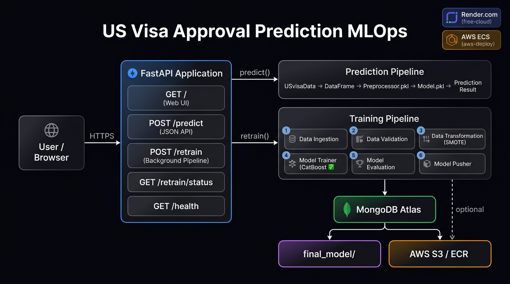
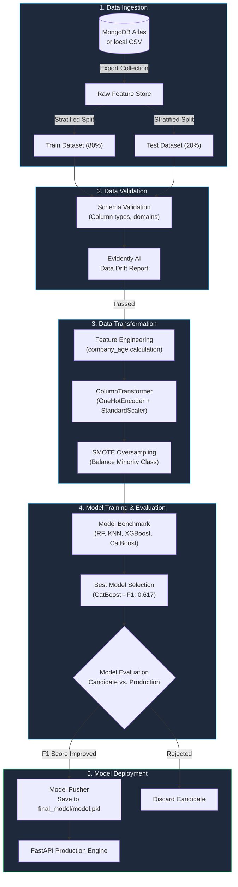
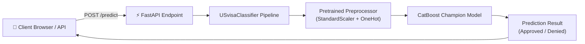

<div align="center">

# 🏛️ US Visa Approval Predictor

**Production MLOps Pipeline · Automated Model Lifecycle · Real-Time Inference**

An enterprise-grade machine learning system that predicts US visa application outcomes based on applicant profiles and employer attributes — engineered as an end-to-end, reproducible MLOps pipeline served via FastAPI and Docker.

[](https://usvisa-demo.onrender.com)
[](https://python.org)
[](https://fastapi.tiangolo.com)
[](https://catboost.ai)
[](https://docker.com)
[](https://mongodb.com)

</div>

---

## 📑 Table of Contents

| Section | Description |
|---|---|
| [What is This?](#-what-is-this) | System overview and key capabilities |
| [Architecture & Workflow](#-architecture--workflow) | End-to-end MLOps pipeline, real-time query flow, and container layout |
| [Model Performance & Evaluation](#-model-performance--evaluation) | Model comparison matrix, metric thresholds, and champion hyperparameters |
| [Tech Stack & Libraries](#-tech-stack--libraries) | External dependencies and Python standard library utilization |
| [System Requirements](#-system-requirements) | Hardware, runtime, and container prerequisites |
| [Quickstart (Local Development)](#-quickstart--local-development) | Step-by-step setup guide for local environments |
| [Docker Deployment](#-docker-deployment) | Containerization instructions and execution commands |
| [API Reference](#-api-reference) | REST endpoints, payload schemas, and example JSON responses |
| [Configuration Reference](#-configuration-reference) | Environment variable definitions and defaults |
| [Project Structure](#-project-structure) | Comprehensive repository directory tree |
| [Branching Strategy](#-branching-strategy) | Multi-environment deployment structure |
| [Troubleshooting](#-troubleshooting) | Common runtime issues and resolutions |
| [References & Links](#-references--links) | Datasets, research, and documentation |

---

## 🧠 What is This?

This project delivers an automated classification system predicting whether an Office of Foreign Labor Certification (OFLC) visa petition will be approved or denied. Rather than a standalone script or exploratory notebook, the codebase is architected as an **industrial-grade MLOps system** adhering to strict separation of concerns, immutable artifact passing, data drift detection, and candidate-versus-production model evaluation.

### Key Capabilities

| Feature | Detail |
|---|---|
| 🔄 **Modular 6-Stage Pipeline** | Decoupled execution across ingestion, validation, transformation, training, evaluation, and pusher |
| 🛡️ **Data Validation & Drift** | Schema compliance verification and Evidently AI drift reports against reference baselines |
| ⚖️ **Imbalance Handling** | Synthetic Minority Over-sampling Technique (SMOTE) integration to handle skewed approval distributions |
| 🏆 **Champion / Challenger Evaluation** | Automated gating comparing newly trained candidate models against active production models |
| ⚡ **Asynchronous Retraining** | Non-blocking background thread execution via `/retrain` API with status polling |
| 🐳 **Zero-Dependency Container** | Self-contained Docker image runnable on any cloud or local environment |
| 🎨 **Interactive UI & REST API** | Glassmorphic web frontend plus OpenAPI-compliant JSON endpoints |

---

## ⚙️ Architecture & Workflow

The architecture separates batch model lifecycle operations from low-latency real-time inference.

### High-Level Architecture



### MLOps Training Pipeline Flow



### Real-Time Inference Interaction



### Container Architecture

```
┌────────────────────────────────────────────────────────────────────────┐
│                        Docker Container (:8080)                        │
│                                                                        │
│  ┌──────────────────┐    ┌──────────────────┐    ┌──────────────────┐  │
│  │   FastAPI Web    │───▶│ Prediction       │───▶│ Preprocessor +   │  │
│  │   App & Engine   │    │ Pipeline         │    │ CatBoost Model   │  │
│  └────────┬─────────┘    └──────────────────┘    └──────────────────┘  │
│           │                                                            │
│           ▼ (POST /retrain)                                            │
│  ┌──────────────────┐    ┌──────────────────┐    ┌──────────────────┐  │
│  │ Threading Worker │───▶│ 6-Stage Training │───▶│ Artifact Store   │  │
│  │ Background Task  │    │ Pipeline         │    │ (artifact/ &     │  │
│  └──────────────────┘    └──────────────────┘    │  final_model/)   │  │
│                                                  └──────────────────┘  │
│                                                                        │
│  Port: 8080 (or $PORT) | Non-root runtime compatible                   │
└────────────────────────────────────────────────────────────────────────┘
```

---

## 📊 Model Performance & Evaluation

Multiple classification models were benchmarked under identical cross-validation conditions on the EasyVisa dataset:

| Model | Accuracy | F1 Score | Precision | Recall | Selection |
|---|:---:|:---:|:---:|:---:|:---:|
| K-Nearest Neighbors | 66.74% | 0.552 | 0.517 | 0.592 | Evaluated |
| Random Forest Classifier | 70.25% | 0.587 | 0.565 | 0.610 | Evaluated |
| XGBoost Classifier | 71.09% | 0.605 | 0.574 | 0.640 | Evaluated |
| **CatBoost Classifier** | **71.94%** | **0.617** | **0.584** | **0.653** | 🏆 **Production Champion** |

### Champion Model Hyperparameters

```yaml
algorithm: CatBoostClassifier
parameters:
  depth: 10
  iterations: 300
  learning_rate: 0.1
  l2_leaf_reg: 3
  eval_metric: "F1"
  random_seed: 42
```

The preprocessor pipeline (scaling and encoding) and the trained model estimator are packaged together into a custom `USvisaModel` object and serialized using `dill` to `final_model/model.pkl`, guaranteeing zero training-serving skew.

---

## 📚 Tech Stack & Libraries

### External Dependencies

| # | Library | Version | Layer | Purpose |
|---|---------|---------|-------|---------|
| 1 | **`fastapi`** | `>=0.100.0` | ⚡ Web Serving | High-performance ASGI framework providing RESTful prediction endpoints and retrain control |
| 2 | **`uvicorn`** | `>=0.20.0` | 🌐 Server Engine | Lightning-fast ASGI web server implementation |
| 3 | **`catboost`** | `>=1.2.0` | 🤖 Machine Learning | State-of-the-art gradient boosted decision tree classifier selected for production |
| 4 | **`xgboost`** | `>=2.0.0` | 🤖 Machine Learning | Optimized distributed gradient boosting algorithm for comparative evaluation |
| 5 | **`scikit-learn`** | `>=1.3.0` | 🧮 Preprocessing & ML | Feature transformers (`OneHotEncoder`, `StandardScaler`, `ColumnTransformer`) and baseline models |
| 6 | **`imblearn`** | `>=0.11.0` | ⚖️ Data Balancing | SMOTE implementation to balance the positive and negative class distributions |
| 7 | **`pymongo`** / **`certifi`** | `>=4.4.0` | 🗄️ Data Storage | Secure MongoDB Atlas driver with verified CA certificate authority bundles |
| 8 | **`evidently`** | `>=0.4.0` | 🛡️ Data Monitoring | Automated data drift analysis and statistical validation test suites |
| 9 | **`pandas`** | `>=2.0.0` | 📊 Data Manipulation | High-performance DataFrame operations and transformation pipelines |
| 10 | **`numpy`** | `>=1.24.0` | 🔢 Numerical Math | Linear algebra computations and multi-dimensional array operations |
| 11 | **`dill`** | `>=0.3.7` | 💾 Serialization | Robust pickling of nested Python objects, lambdas, and composite pipelines |
| 12 | **`jinja2`** | `>=3.1.0` | 🎨 UI Templating | HTML rendering engine for the interactive prediction interface |
| 13 | **`boto3`** | `>=1.28.0` | ☁️ Cloud Storage | AWS SDK for syncing artifacts to Amazon S3 buckets (AWS deployment branch) |
| 14 | **`from_root`** | `>=1.4.0` | 📁 Path Utilities | Dynamic root-anchored directory path resolution across OS environments |

### Python Standard Library Usage

| Module | Used In | Purpose |
|---|---|---|
| `threading` | `app.py` | Asynchronously executes the heavy training pipeline without blocking web traffic |
| `dataclasses` | `entity/config_entity.py`, `artifact_entity.py` | Strongly-typed immutable configuration and output artifact specifications |
| `os` / `sys` | Throughout package | Environment variable extraction, path joining, and sys traceback formatting |
| `typing` | Throughout package | Static typing (`Optional`, `Dict`, `List`, `Tuple`, `Any`) to guarantee code correctness |
| `logging` | `us_visa/logger/__init__.py` | Rotating timestamped event logging written concurrently to console and disk |
| `shutil` | `us_visa/utils/main_utils.py` | File system operations, artifact replication, and directory cleanups |
| `datetime` | Pipeline timestamps | Formatting unique ISO/timestamp artifact directories (`artifact/MM_DD_YYYY_HH_MM_SS`) |

---

## 💻 System Requirements

| Component | Minimum | Recommended |
|---|---|---|
| **RAM** | 4 GB | 8 GB+ |
| **CPU** | 2 Cores (x86_64 or ARM64) | 4 Cores |
| **Disk Space** | 2 GB free | 5 GB free |
| **OS** | Windows 10+ / macOS / Linux | Ubuntu 22.04+ / Windows 11 |
| **Python** | 3.10 | 3.11 |
| **Docker** | 20.10+ | 24.0+ |

---

## 🚀 Quickstart (Local Development)

### 1. Clone Repository & Setup Environment

```bash
# Clone the repository
git clone https://github.com/PanchalAnubhav/USvisa_approval_systmm.git
cd USvisa_approval_systmm

# Create and activate virtual environment (Python 3.11 recommended)
python -m venv venv

# Windows
venv\Scripts\activate
# Linux / macOS
source venv/bin/activate

# Install dependencies in editable mode
pip install --upgrade pip
pip install -r requirements.txt
```

### 2. Configure Environment Variables

```bash
# Copy template configuration
cp .env.example .env
```

Edit your `.env` file with your credentials:

```ini
MONGODB_URL=mongodb+srv://<username>:<password>@cluster0.mongodb.net/?retryWrites=true&w=majority
DATABASE_NAME=US_VISA
COLLECTION_NAME=visa_data
APP_HOST=0.0.0.0
APP_PORT=8080
```

> **Note:** If MongoDB is unreachable, the data ingestion component automatically falls back to the bundled local CSV dataset.

### 3. Run Pipeline or Launch Web App

```bash
# Launch FastAPI web application
uvicorn app:app --host 0.0.0.0 --port 8080 --reload
```

Visit the interactive web interface at: **http://127.0.0.1:8080**

---

## 🐳 Docker Deployment

### Local Container Build

```bash
# Build the production container image
docker build -t usvisa-app:latest .

# Run container with environment file
docker run -d \
  -p 8080:8080 \
  --env-file .env \
  --name usvisa-predictor \
  usvisa-app:latest
```

### Using Docker Compose

```bash
# Start container in detached mode
docker compose up -d

# Inspect logs
docker compose logs -f

# Teardown
docker compose down
```

---

## 📡 API Reference

### Endpoints Overview

| Method | Endpoint | Description |
|---|---|---|
| `GET` | `/` | Renders interactive HTML prediction dashboard |
| `POST` | `/predict` | Evaluates single applicant profile and returns approval verdict |
| `POST` | `/retrain` | Triggers non-blocking background model retraining pipeline (HTTP 202) |
| `GET` | `/retrain/status` | Returns current background retraining status and execution metrics |
| `GET` | `/health` | Liveness check returning system and model readiness |

---

### Prediction Payload Schema (`POST /predict`)

```json
{
  "continent": "Asia",
  "education_of_employee": "Master's",
  "has_job_experience": "Y",
  "requires_job_training": "N",
  "no_of_employees": 5000,
  "region_of_employment": "South",
  "prevailing_wage": 85000.0,
  "unit_of_wage": "Year",
  "full_time_position": "Y",
  "company_age": 15
}
```

### Prediction Response

```json
{
  "status": true,
  "prediction": "Visa-Approved",
  "prediction_value": 1
}
```

---

## 📋 Configuration Reference

All configurations are managed via environment variables:

| Variable | Type | Default | Description |
|---|:---:|:---:|---|
| `MONGODB_URL` | `string` | *(optional)* | MongoDB connection URI for fetching application records |
| `DATABASE_NAME` | `string` | `US_VISA` | MongoDB database identifier |
| `COLLECTION_NAME` | `string` | `visa_data` | MongoDB collection storing historical visa petitions |
| `APP_HOST` | `string` | `0.0.0.0` | Host IP binding address for Uvicorn server |
| `APP_PORT` | `integer` | `8080` | Network port for web server (`$PORT` dynamically handled in cloud) |
| `AWS_ACCESS_KEY_ID` | `string` | *(optional)* | AWS credential for S3 artifact syncing (production AWS branch) |
| `AWS_SECRET_ACCESS_KEY` | `string` | *(optional)* | AWS secret access key |
| `AWS_REGION` | `string` | `us-east-1` | Target AWS region |

---

## 📁 Project Structure

```
USvisa_approval_systmm/
│
├── .github/workflows/
│   └── aws.yaml                 # CI/CD workflow for AWS ECR & ECS deployment
│
├── us_visa/                     # Core application package
│   ├── cloud_storage/           # AWS S3 artifact management layer
│   │   ├── __init__.py
│   │   └── aws_storage.py
│   │
│   ├── components/              # 6 modular pipeline stages
│   │   ├── __init__.py
│   │   ├── data_ingestion.py    # MongoDB extraction & train/test splitting
│   │   ├── data_validation.py   # Schema checks & Evidently drift analysis
│   │   ├── data_transformation.py # ColumnTransformer & SMOTE pipeline
│   │   ├── model_trainer.py     # Multi-model benchmarking & hyperopt
│   │   ├── model_evaluation.py  # Champion/Challenger evaluation gate
│   │   └── model_pusher.py      # Production artifact promotion
│   │
│   ├── configuration/           # Database & cloud connection clients
│   ├── constants/               # System-wide static variables & paths
│   ├── data_access/             # MongoDB data extraction DAO
│   ├── entity/                  # Strongly-typed config & artifact entities
│   │   ├── config_entity.py
│   │   ├── artifact_entity.py
│   │   └── estimator.py
│   │
│   ├── exception/               # Custom exception handler with line-level traceback
│   ├── logger/                  # Structured console and file logging handler
│   ├── pipeline/                # Orchestrated pipelines
│   │   ├── training_pipeline.py # End-to-end batch training orchestrator
│   │   └── prediction_pipeline.py # Online feature transformation & inference
│   │
│   └── utils/                   # YAML parsing, dill serializer & file helpers
│
├── config/                      # Declarative configuration files
│   ├── schema.yaml              # Dataset column definitions & domain constraints
│   └── model.yaml               # Model candidate parameter grids
│
├── templates/
│   └── usvisa.html              # Interactive glassmorphic prediction dashboard
│
├── static/                      # Frontend assets, styling, and documentation images
│   ├── css/style.css
│   └── docs/
│       ├── architecture.jpg     # System architecture diagram
│       └── ui_screenshot.jpg    # Dashboard interface capture
│
├── final_model/                 # Live production model container
│   ├── model.pkl                # Active champion preprocessor + model artifact
│   └── .gitkeep
│
├── app.py                       # FastAPI application & REST endpoint router
├── Dockerfile                   # Hardened production container definition
├── docker-compose.yml           # Multi-container orchestration specification
├── render.yaml                  # Cloud infrastructure definition (free-cloud)
├── requirements.txt             # Pinned core production dependencies
├── requirements-dev.txt         # Development & testing tooling
├── setup.py                     # Package setup script
└── README.md                    # System documentation
```

---

## 🌿 Branching Strategy

| Branch | Environment | Purpose |
|---|---|---|
| `main` | Production Core | Primary codebase and source of truth |
| `free-cloud` | Cloud Staging | Live deployment on Render.com ([usvisa-demo.onrender.com](https://usvisa-demo.onrender.com)) without credit card lock-in |
| `aws-deploy` | AWS Production | Enterprise deployment target with AWS ECR container push and ECS task execution |

---

## 🔧 Troubleshooting

<details>
<summary><strong>MongoDB connection timeout or authentication failure</strong></summary>

**Symptom:** `ServerSelectionTimeoutError` when running ingestion.  
**Resolution:**
- Check IP whitelist in MongoDB Atlas dashboard (ensure `0.0.0.0/0` is allowed for remote containers).
- The pipeline includes an automatic fallback: if MongoDB is unavailable, it seamlessly switches to the local backup dataset at `EasyVisa.csv`.
</details>

<details>
<summary><strong>ModuleNotFoundError / Root Directory Resolution</strong></summary>

**Symptom:** `from_root` raises `FileNotFoundError` inside Docker.  
**Resolution:**
- Ensure the project contains a root marker (`.project-root` or `.git`). The Docker build script creates this marker automatically to support containerized environments.
</details>

<details>
<summary><strong>Render Free Tier Cold Starts</strong></summary>

**Symptom:** First web request takes 30–50 seconds to respond.  
**Resolution:**
- Render's free tier spins down compute instances after 15 minutes of inactivity. Once initialized, subsequent requests execute in sub-100ms latency.
</details>

<details>
<summary><strong>Port Conflict During Local Execution</strong></summary>

**Symptom:** `[Errno 10048] error while attempting to bind on address ('0.0.0.0', 8080)`.  
**Resolution:**
- Run Uvicorn on a different port: `uvicorn app:app --host 0.0.0.0 --port 8081`
</details>

---

## 🔗 References & Links

### Dataset & ML Research

| Resource | Description | Link |
|---|---|---|
| **EasyVisa Dataset** | 25,000+ historical US visa petition applications with demographic data | [Kaggle Dataset](https://www.kaggle.com/datasets/moro23/easyvisa-dataset) |
| **CatBoost** | Fast, scalable gradient boosting on decision trees | [CatBoost Documentation](https://catboost.ai/docs/) |
| **SMOTE** | Synthetic Minority Over-sampling Technique for class imbalance | [JMLR Research Paper](https://www.jair.org/index.php/jair/article/view/10302) |
| **Evidently AI** | Open-source ML observability, data drift, and model evaluation | [Evidently Docs](https://docs.evidentlyai.com/) |

### Frameworks & Infrastructure

| Tool | Documentation | Source Code |
|---|---|---|
| **FastAPI** | [fastapi.tiangolo.com](https://fastapi.tiangolo.com) | [GitHub](https://github.com/tiangolo/fastapi) |
| **Docker** | [docs.docker.com](https://docs.docker.com) | [GitHub](https://github.com/docker) |
| **Uvicorn** | [uvicorn.org](https://www.uvicorn.org) | [GitHub](https://github.com/encode/uvicorn) |
| **MongoDB Atlas** | [mongodb.com/docs/atlas](https://www.mongodb.com/docs/atlas/) | [GitHub Driver](https://github.com/mongodb/mongo-python-driver) |

---

<div align="center">

Developed by **[Anubhav Panchal](https://github.com/PanchalAnubhav)**

</div>
