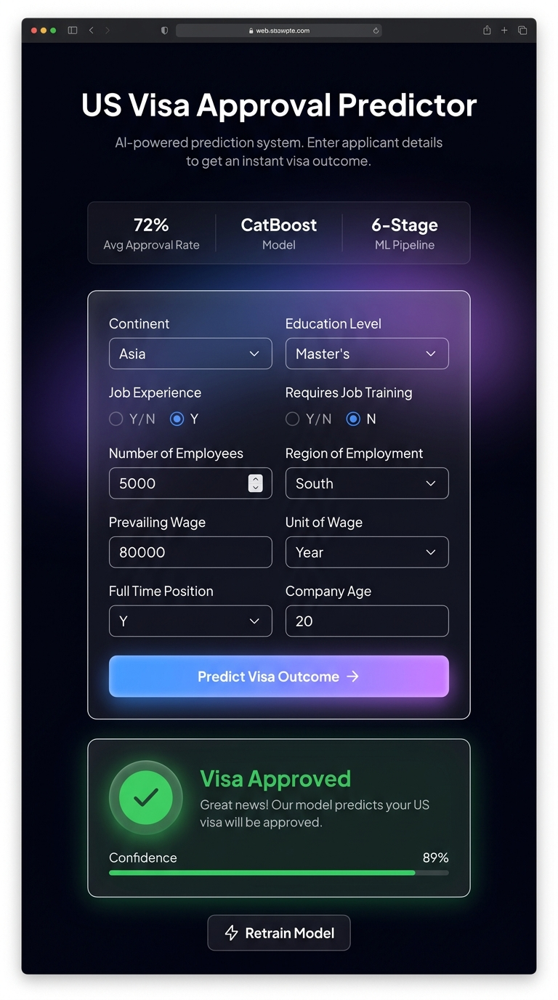

<div align="center">

# US Visa Approval Predictor

**End-to-end MLOps pipeline for predicting US visa outcomes**

[](https://usvisa-demo.onrender.com)
[](https://python.org)
[](https://fastapi.tiangolo.com)
[](https://docker.com)
[](https://mongodb.com)

</div>

---

## What is this?

A classification system that predicts whether a US visa application will be approved or denied, based on applicant and employer attributes. The project is structured as a modular MLOps pipeline — not a Jupyter notebook export — with separate stages for ingestion, validation, transformation, training, evaluation, and deployment.

The trained model (CatBoost) is served through a FastAPI backend with a web UI. The entire stack runs inside a single Docker container.

> **Try it:** [https://usvisa-demo.onrender.com](https://usvisa-demo.onrender.com)
>
> First load may take ~30s — the free-tier container boots on demand.

---

## Architecture


---

## Screenshots

<div align="center">

</div>

---

## Pipeline

The training pipeline runs 6 stages sequentially. Each stage produces typed artifacts that feed into the next.

| # | Stage | Description |
|---|-------|-------------|
| 1 | Data Ingestion | Pulls the EasyVisa dataset from MongoDB Atlas (falls back to local CSV if unreachable) |
| 2 | Data Validation | Schema checks + Evidently drift report |
| 3 | Data Transformation | Categorical encoding, numeric scaling, SMOTE oversampling |
| 4 | Model Training | Trains RF, KNN, XGBoost, CatBoost — picks the best by F1 |
| 5 | Model Evaluation | Compares candidate vs. production model — only promotes if improved |
| 6 | Model Pusher | Writes accepted model to `final_model/` (optionally S3) |

---

## Model Performance

From the latest training run:

| Model | Accuracy | F1 | Precision | Recall |
|-------|:--------:|:--:|:---------:|:------:|
| Random Forest | 70.25% | 0.587 | 0.565 | 0.610 |
| KNN | 66.74% | 0.552 | 0.517 | 0.592 |
| XGBoost | 71.09% | 0.605 | 0.574 | 0.640 |
| **CatBoost** | **71.94%** | **0.617** | **0.584** | **0.653** |

CatBoost was selected. Hyperparameters: `learning_rate=0.1`, `depth=10`, `iterations=300`, `l2_leaf_reg=3`.

The model and preprocessing pipeline are bundled into a single `USvisaModel` object, serialised with `dill`, and stored at `final_model/model.pkl`.

---

## Tech Stack

| Layer | Tools |
|-------|-------|
| ML | CatBoost, XGBoost, scikit-learn, imbalanced-learn (SMOTE), Evidently |
| Backend | FastAPI, Uvicorn, Pydantic |
| Data | MongoDB Atlas, pymongo, pandas, numpy |
| Serialisation | dill |
| Infra | Docker, docker-compose, GitHub Actions |
| Hosting | Render.com (free demo), AWS ECR/ECS (production-ready branch) |
| Frontend | Vanilla HTML/CSS/JS, glassmorphism design |

---

## Project Layout

```
.
├── app.py                      # FastAPI app — routes, retrain, predict
├── Dockerfile
├── docker-compose.yml
├── render.yaml                 # Render.com config (free-cloud branch)
├── requirements.txt
├── requirements-dev.txt
├── setup.py
│
├── us_visa/
│   ├── components/             # Pipeline stages
│   │   ├── data_ingestion.py
│   │   ├── data_validation.py
│   │   ├── data_transformation.py
│   │   ├── model_trainer.py
│   │   ├── model_evaluation.py
│   │   └── model_pusher.py
│   ├── pipeline/
│   │   ├── training_pipeline.py
│   │   └── prediction_pipeline.py
│   ├── entity/                 # Config + artifact dataclasses
│   ├── cloud_storage/          # S3 helpers
│   ├── data_access/            # MongoDB access layer
│   ├── constants/
│   ├── logger/
│   ├── exception/
│   └── utils/
│
├── templates/usvisa.html       # Web UI
├── static/                     # CSS, icons, docs
├── config/                     # schema.yaml, model.yaml
├── notebook/                   # EDA notebooks
├── tests/
├── final_model/                # Production model artifacts
└── .github/workflows/aws.yaml # CI/CD
```

---

## API

| Method | Path | Description |
|--------|------|-------------|
| `GET` | `/` | Web UI |
| `POST` | `/predict` | JSON prediction endpoint |
| `POST` | `/retrain` | Triggers background training (returns 202) |
| `GET` | `/retrain/status` | Poll training progress |
| `GET` | `/health` | Health check |

**Predict request:**

```json
{
  "continent": "Asia",
  "education_of_employee": "Master's",
  "has_job_experience": "Y",
  "requires_job_training": "N",
  "no_of_employees": 5000,
  "region_of_employment": "South",
  "prevailing_wage": 80000,
  "unit_of_wage": "Year",
  "full_time_position": "Y",
  "company_age": 20
}
```

**Response:**

```json
{
  "status": true,
  "prediction": "Visa-Approved",
  "prediction_value": 1
}
```

---

## Getting Started

```bash
# Clone
git clone https://github.com/PanchalAnubhav/USvisa_approval_systmm.git
cd USvisa_approval_systmm

# Install
pip install -r requirements-dev.txt

# Configure
cp .env.example .env   # fill in MONGODB_URL, etc.

# Run
uvicorn app:app --host 0.0.0.0 --port 8080 --reload
```

### Docker

```bash
docker build -t usvisa-app .
docker compose up -d
# → http://localhost:8080
```

---

## Branches

| Branch | Purpose |
|--------|---------|
| `main` | Development / source of truth |
| `free-cloud` | Live demo on Render.com (no credit card) — [usvisa-demo.onrender.com](https://usvisa-demo.onrender.com) |
| `aws-deploy` | AWS ECR + ECS deployment via GitHub Actions |

These branches are kept isolated. Changes to one don't affect the others.

---

## Environment Variables

| Variable | Required | Notes |
|----------|:--------:|-------|
| `MONGODB_URL` | Yes | Atlas connection string |
| `DATABASE_NAME` | Yes | |
| `COLLECTION_NAME` | Yes | |
| `APP_HOST` | Yes | Default `0.0.0.0` |
| `APP_PORT` | Yes | Default `8080` |
| `AWS_ACCESS_KEY_ID` | No | Only for S3/ECR |
| `AWS_SECRET_ACCESS_KEY` | No | Only for S3/ECR |
| `AWS_REGION` | No | e.g. `us-east-1` |

---

## Author

**Anubhav Panchal** — [GitHub](https://github.com/PanchalAnubhav)
